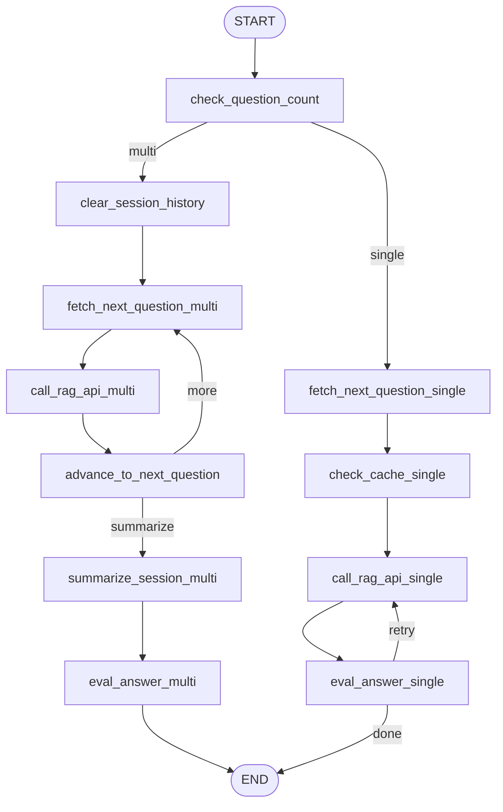

# OrchestraRAG

## Table of Contents
- [Introduction](#introduction)
- [Features](#features)
- [Application Architecture](#application-architecture)
- [Setup and Installation](#setup-and-installation)
- [Usage](#usage)
- [Best Practices](#best-practices)
- [Performance Considerations](#performance-considerations)
- [Acknowledgments](#acknowledgments)


## Orchestrating RAG Workflows with LangGraph and FastAPI

### Workflow Diagram
The following Mermaid diagram illustrates the high-level workflow of OrchestraRAG, including single and multi-question processing:




&#x20;*(A visual representation of the LangGraph workflow, generated by Graphviz. This file will be generated automatically upon application startup if Graphviz is installed.)*

## Project Overview
OrchestraRAG is a state-of-the-art orchestration layer for Retrieval-Augmented Generation (RAG) workflows. It combines the power of LangGraph and FastAPI to deliver:
- Stateful, multi-step workflows for intelligent question answering.
- Robust session management and caching for enhanced performance.
- Extensibility for integrating with external APIs and services.

## 1. Introduction

OrchestraRAG is a robust and production-ready API service meticulously designed to orchestrate complex Retrieval-Augmented Generation (RAG) workflows. It leverages the cutting-edge **LangGraph** framework for building stateful, multi-step RAG pipelines and exposes these capabilities via a high-performance **FastAPI** interface.

The primary goal of OrchestraRAG is to provide a flexible, intelligent, and resilient querying system that can:

- Process single or multiple user questions within a single request.
- Maintain conversational context across turns using unique session IDs.
- Seamlessly integrate with an external RAG service for answer generation and source retrieval.
- Implement advanced features such as caching and an adaptive retry mechanism for low-relevance answers.
- Offer comprehensive evaluation feedback for each generated answer.

OrchestraRAG rigorously follows the **Separation of Concerns (SoC)** principle, ensuring a clean, maintainable, scalable, and testable architecture ideal for integration into larger AI applications.

## 2. Features

---

- **Intelligent RAG Querying:** Retrieves relevant information from an external RAG service and generates coherent, contextual answers.
- **Multi-Question Processing:** Handles a list of questions in a single API call, processing them sequentially within the same session.
- **Robust Session Management:** Uses an `X-Session-Id` HTTP header to maintain distinct conversational contexts; allows clearing session history for fresh starts.
- **Configurable Caching:** Checks and uses an external RAG service's cache for quicker responses to previously answered questions (single-question flow only).
- **Comprehensive Answer Evaluation:** Interfaces with an evaluation service to assess answer quality (e.g., relevance, faithfulness, fluency).
- **Adaptive Retry Mechanism:** Automatically retries RAG queries with caching disabled if the answer's relevance is below a configurable threshold (single-question only).
- **Externalized Configuration:** Uses a `settings.toml` file for managing all parameters; environment variables can override them.
- **Structured Outputs:** JSON responses include answers, sources, models used, execution timings, and evaluations.
- **Workflow Visualization:** Generates a Graphviz DOT file and PNG image of the LangGraph workflow on startup.
- **Stateful:** Uses a multi-step workflows for intelligent question answering.
- **Extensibility:** Allows extebsibility for integrating with external APIs and services.

### LangGraph Features Used
- Stateful, multi-step workflows.
- Robust session management.
- Extensibility for external APIs.

### FastAPI Features Used
- High-performance API layer.
- Easy integration with LangGraph pipelines.

## 3. Feature Support Overview

| Feature                   | Single Question | Multi-Question | Description                                                            |
| ------------------------- | --------------- | -------------- | ---------------------------------------------------------------------- |
| **RAG Querying**          | ✅ Yes           | ✅ Yes          | Queries external RAG service to get answers and sources.               |
| **Session Management**    | ✅ Yes           | ✅ Yes          | Maintains unique session context using `X-Session-Id`.                 |
| **Cache Integration**     | ✅ Yes           | ❌ No           | Uses cache for single-question flows only.                             |
| **Answer Evaluation**     | ✅ Yes           | ✅ Yes          | Evaluates answers; batch evaluation in multi-question flows.           |
| **Low-Relevance Retry**   | ✅ Yes           | ❌ No           | Retries if answer relevance is below threshold (single-question only). |
| **Sequential Processing** | ✅ Yes           | ✅ Yes          | Processes questions in the order provided.                             |
| **Session Summarization** | ❌ No            | ✅ Yes          | Optionally summarizes session after all multi-questions are processed. |
| **Configurable Params**   | ✅ Yes           | ✅ Yes          | Managed via `settings.toml` and environment variables.                 |
| **Node Timings**          | ✅ Yes           | ✅ Yes          | Response includes duration for each graph node.                        |

## 4. LangGraph Features Used

- **StateGraph:** Defines the stateful, cyclical workflow.
- **Annotated with **``**:** Manages state freshness across steps.
- **Nodes:** Each atomic step (e.g., question check, RAG call, evaluation).
- **Edges:** Direct transitions between nodes.
- **Conditional Edges:** Enables dynamic routing (e.g., based on retry condition or flow type).
- **START / END Nodes:** Define workflow entry/exit points.
- ``**:** Triggers the graph execution in the FastAPI route.

## 🏗️ Application Architecture

---

```text
+-------------------------------+
|     Client (UI, curl, app)    |
+-------------------------------+
              |
              v
+-------------------------------+
|        FastAPI API Layer      |
|   (/invoke, /update-policy,   |
|    /summarize_session, etc.)  |
+-------------------------------+
              | (X-Session-Id Header)
              v
+-------------------------------+
|        Session Manager        |
|    (In-Memory or Redis)       |
+-------------------------------+
              | (Question, Context)
              v
+-------------------------------+
|        RAG Pipeline           |
|  (Orchestration & Retrieval)  |
+-------------------------------+
              |
              v
+-------------------------------+    +------------------------------+
|      Document Loader          |--->|      Text Splitter            |
|  (Markdown, Table-Aware,      |    |   (Chunking for LLM input)    |
|   Multiple Policy Types)      |    +------------------------------+
+-------------------------------+
              |
              v
+-------------------------------+
|      Embedding Model          |
| (Ollama or Compatible Model)  |
+-------------------------------+
              |
              v
+-------------------------------+
|        Vector Store           |
|    (Chroma, FAISS, etc.)      |
+-------------------------------+
              ^
              | (Semantic Search)
              |
+-------------------------------+
|        RAG Pipeline           |
|   (Find relevant chunks)      |
+-------------------------------+
              |
              v
+-------------------------------+
|    LLM (Ollama, others)       |
| (Reasoning & Generation)      |
+-------------------------------+
              |
              v
+-------------------------------+
|      Response Cache           |
| (File, Redis, etc.)           |
+-------------------------------+
              |
              v
+-------------------------------+
|   Client (Receives Answer)    |
+-------------------------------+
```
---

```text
OrchestraRAG/
├── config/                # Configuration settings
│   └── settings.toml      # External parameters
├── api/                   # API layer
│   ├── main.py            # FastAPI app, endpoints
│   └── models.py          # Pydantic schemas
├── core/                  # LangGraph logic
│   ├── config_manager.py  # Loads settings
│   ├── graph_builder.py   # Graph nodes and logic
│   ├── state.py           # Defines RAGLoopState
│   ├── nodes.py           # Individual graph node logic
│   └── utils.py           # Helpers, decorators
├── tests/                 # Tests for nodes, graph, API
├── .env                   # Secrets and environment-specific overrides
└── README.md              # Project documentation
```

### Flow

1. **Request:** Client sends POST to `/run-sequence` with JSON body and `X-Session-Id` header.
2. **API:** Validates request, initializes graph state, invokes LangGraph.
3. **Core:** Nodes interact with external RAG API, update state, and handle retry logic.
4. **Response:** Final state is parsed and formatted into a JSON response.

## 6. Installation

### Requirements

- Python 3.8+
- `pip`
- Graphviz (for graph visualization)

### Setup

```bash
git clone https://github.com/your-username/OrchestraRAG.git
cd OrchestraRAG
python -m venv .venv
source .venv/bin/activate
pip install -r requirements.txt
mkdir config && touch config/settings.toml
touch .env
```

Add `.env` to `.gitignore` to protect secrets.

## 7. Sample `settings.toml`

```toml
[app_settings]
use_emojis = true

[rag_service]
base_url = "http://localhost:8083"
max_rag_retries = 2
rag_timeout_seconds = 360
eval_timeout_seconds = 320
clear_history_timeout_seconds = 130
check_cache_timeout_seconds = 30
summarize_timeout_seconds = 360
eval_all_timeout_seconds = 760

[evaluation]
min_relevance_score = 3

[server]
host = "0.0.0.0"
port = 8000
```

## 8. Usage

## Deployment Options

### Development Server

```bash
uvicorn api.main:app --host 0.0.0.0 --port 8084 --reload
```

### Production Server (Gunicorn)

```bash
gunicorn api.main:app -w 4 -k uvicorn.workers.UvicornWorker --bind 0.0.0.0:8084
```

### Docker Deployment
To deploy OrchestraRAG using Docker, follow these steps:
1. Build the Docker image:
   ```bash
   docker build -t orchestrarag .
   ```
2. Run the container:
   ```bash
   docker run -d -p 8084:8084 orchestrarag
  ```
### Endpoints

#### `POST /run-sequence`

```json
{
  "questions": ["What is the capital of France?"],
  "use_cache": false,
  "eval": true
}
```

#### `GET /graphviz`

Returns the LangGraph DOT format to visualize.
The `/graphviz` endpoint generates a `.dot` file and a `.png` image of the workflow. Below is an example of the generated visualization:

To generate the visualization:
1. Ensure Graphviz is installed on your system.
2. Start the application and access the `/graphviz` endpoint.

### Example cURL (Single Question with Retry)
### Request
```bash
curl -X POST http://localhost:8084/run-sequence \
  -H "Content-Type: application/json" \
  -H "X-Session-Id: it-support-session-123" \
  -d '{
    "questions": [
      "What is the process for requesting additional software installations on a company laptop?"
    ],
    "use_cache": false,
    "eval": true,
    "model": "llama3.2"
  }' | jq

```

### Example Response

```json
{
  "answers": [
    "According to Section 3.2 of the IT Policy, employees must submit a software request form via the IT Support Portal. The request will be reviewed within 3 business days, and approved software will be installed remotely or during a scheduled IT support session."
  ],
  "structured_answers": [
    {
      "question": "What is the process for requesting additional software installations on a company laptop?",
      "answer": "According to Section 3.2 of the IT Policy, employees must submit a software request form via the IT Support Portal. The request will be reviewed within 3 business days, and approved software will be installed remotely or during a scheduled IT support session.",
      "sources": [
        {
          "text": "## 3. IT Policies\n### 3.2 Software Requests\n- Submit a software request form via the IT Support Portal.\n- Requests are reviewed within 3 business days.\n- Approved software is installed remotely or during a scheduled IT support session.",
          "metadata": {
            "id": "it_policy_2025",
            "name": "IT Policy 2025",
            "type": "IT",
            "upload_date": "2025-06-01",
            "version": "1.0",
            "Header 1": "IT Policy 2025",
            "Header 2": "3. IT Policies",
            "Header 3": "3.2 Software Requests"
          }
        }
      ],
      "model_used": "llama3.2",
      "evaluation": {
        "fluency": 5,
        "faithfulness": 5,
        "relevance": 5,
        "conciseness": 4,
        "evaluated_at": "2025-07-01T12:54:59.513035+00:00"
      }
    }
  ],
  "summary": null,
  "node_timings": {
    "check_question_count": 0.0001,
    "fetch_next_question": 0.0001,
    "check_cache": 0.0001,
    "call_rag_api": 15.2667,
    "eval_answer_single": 42.935
  },
  "pipeline_time": 58.2083,
  "active_chain_sessions": null,
  "evaluation_results": {
    "fluency": 5,
    "faithfulness": 5,
    "relevance": 5,
    "conciseness": 4,
    "evaluated_at": "2025-07-01T12:54:59.513035+00:00"
  }
}
```
### Example: Multi-Question Workflow for Compliance Queries

### Request

```bash
curl -X POST http://localhost:8084/run-sequence \
  -H "Content-Type: application/json" \
  -H "X-Session-Id: compliance-session-123" \
  -d '{
    "questions": [
      "What are the data retention policies for customer records?",
      "What is the process for handling GDPR data deletion requests?",
      "How long are employee records retained after termination?"
    ],
    "use_cache": false,
    "eval": true,
    "model": "llama3.2"
  }'
```
### Example Response
```json
{
  "answers": [
    "According to Section 5.1 of the Data Retention Policy, customer records are retained for 7 years unless otherwise required by law. After this period, records are securely deleted.",
    "GDPR data deletion requests must be submitted via the Data Privacy Portal. Requests are processed within 30 days, as outlined in Section 3.2 of the GDPR Compliance Policy.",
    "Employee records are retained for 5 years after termination, as per Section 4.3 of the Employee Records Policy. This includes payroll, performance, and benefits data."
  ],
  "structured_answers": [
    {
      "question": "What are the data retention policies for customer records?",
      "answer": "According to Section 5.1 of the Data Retention Policy, customer records are retained for 7 years unless otherwise required by law. After this period, records are securely deleted.",
      "sources": [
        {
          "text": "## 5. Data Retention Policy\n### 5.1 Customer Records\n- Retention Period: 7 years\n- Secure deletion after retention period.\n---",
          "metadata": {
            "id": "compliance_manual_2025",
            "name": "Compliance Manual 2025",
            "type": "Compliance",
            "upload_date": "2025-06-01",
            "version": "1.0",
            "Header 1": "Compliance Manual 2025",
            "Header 2": "5. Data Retention Policy",
            "Header 3": "5.1 Customer Records"
          }
        }
      ],
      "model_used": "llama3.2"
    },
    {
      "question": "What is the process for handling GDPR data deletion requests?",
      "answer": "GDPR data deletion requests must be submitted via the Data Privacy Portal. Requests are processed within 30 days, as outlined in Section 3.2 of the GDPR Compliance Policy.",
      "sources": [
        {
          "text": "## 3. GDPR Compliance Policy\n### 3.2 Data Deletion Requests\n- Submit via Data Privacy Portal.\n- Processing Time: 30 days.\n---",
          "metadata": {
            "id": "compliance_manual_2025",
            "name": "Compliance Manual 2025",
            "type": "Compliance",
            "upload_date": "2025-06-01",
            "version": "1.0",
            "Header 1": "Compliance Manual 2025",
            "Header 2": "3. GDPR Compliance Policy",
            "Header 3": "3.2 Data Deletion Requests"
          }
        }
      ],
      "model_used": "llama3.2"
    },
    {
      "question": "How long are employee records retained after termination?",
      "answer": "Employee records are retained for 5 years after termination, as per Section 4.3 of the Employee Records Policy. This includes payroll, performance, and benefits data.",
      "sources": [
        {
          "text": "## 4. Employee Records Policy\n### 4.3 Retention Period\n- Retention Period: 5 years after termination.\n- Includes payroll, performance, and benefits data.\n---",
          "metadata": {
            "id": "compliance_manual_2025",
            "name": "Compliance Manual 2025",
            "type": "Compliance",
            "upload_date": "2025-06-01",
            "version": "1.0",
            "Header 1": "Compliance Manual 2025",
            "Header 2": "4. Employee Records Policy",
            "Header 3": "4.3 Retention Period"
          }
        }
      ],
      "model_used": "llama3.2"
    }
  ],
  "summary": "Here is a concise summary:\n\n- Customer records are retained for 7 years and securely deleted afterward.\n- GDPR data deletion requests are processed within 30 days via the Data Privacy Portal.\n- Employee records are retained for 5 years after termination, covering payroll, performance, and benefits data.",
  "node_timings": {
    "check_question_count": 0.0001,
    "clear_session_history": 8.8207,
    "fetch_next_question": 0.0001,
    "call_rag_api": 12.7313,
    "advance_to_next_question": 0.0,
    "summarize_session": 5.8923,
    "eval_answer_multi": 244.1979
  },
  "pipeline_time": 288.872,
  "active_chain_sessions": 1,
  "evaluation_results": null
}
```

## 8. Best Practices

- Use `.env` for secrets, and `settings.toml` for configuration.
- Implement logging and error handling around all external calls.
- Tune API timeouts based on service SLAs.
- Maintain consistent `X-Session-Id` for session continuity.
- Pin dependency versions in `requirements.txt`.
- Modularize new features via new nodes and edges.
- Follow layered testing strategy: unit, integration, and API.
- Use `.env` files for managing secrets:
  - Example:
    ```bash
    REDIS_HOST=localhost
    REDIS_PORT=6379
    ```
- Enable caching for frequently accessed queries.
- Use Graphviz for visualizing workflows.

## 9. Performance Considerations

### Tuning Timeouts
- Adjust timeouts for external API calls in `settings.toml`:
  ```toml
  [rag_service]
  rag_timeout_seconds = 360
  eval_timeout_seconds = 320
  ```

### Caching Strategies
- Enable caching for single-question workflows to reduce latency:
  ```json
  {
    "use_cache": true
  }
  ```

### Scaling the API
- Use a production-grade server like Gunicorn with multiple workers:
  ```bash
  gunicorn api.main:app -w 4 -k uvicorn.workers.UvicornWorker --bind 0.0.0.0:8084
  ```

### Profiling
- Use Python's `cProfile` or a tool like `py-spy` to identify bottlenecks in the workflow.

---

## 10. Conclusion

OrchestraRAG is a powerful orchestration layer for RAG-based systems, offering a clean, extensible framework for stateful AI workflows. Built on LangGraph and FastAPI, it's production-ready and adaptable to many conversational AI needs.

---
## License

This project is licensed under the [MIT License](LICENSE) – see the LICENSE file for details.

## Acknowledgments

- **[LangGraph Team](https://www.langgraph.dev/)** for the excellent stateful workflow framework  
- **[FastAPI Community](https://fastapi.tiangolo.com/)** for the high-performance web framework
---
*(End of README)*

